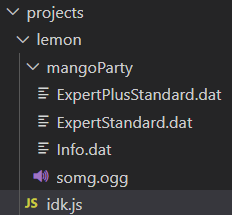
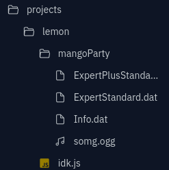
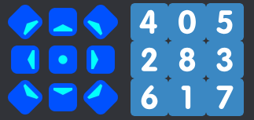

# Lemon's Scuffed Template

## What you will need
(You can find all these in [Important links](#important-links))
- Visual Studio Code (Replit also works, but it's not as easy)
- Node.js
- Archiver


## Creating a project
To get started, create a new folder in `projects`. You can name this whatever you like. Next, create a JavaScript file (you can also name this whatever you like) in the project folder you just created. Afterward, drag your map folder, along with all its contents, into the same folder. Your folder structure should look like this:

**Visual Studio Code:**



**Replit:**



Once you have done that, open up `Lemon's Scuffed Template.js` and copy + paste everything over to the script you created in your project folder.


## Setting up your script
You might have noticed some variables at the top of the file and wondered how to set them up or what values to put in them.

```js
// Edit these v   (check README.md for help)
const projectName = 'lemon';
const mapName = 'mangoParty';
const inputDif = 'ExpertStandard.dat';
const outputDif = 'ExpertPlusStandard';
```

Based on the image above in [Creating a project](#creating-a-project), you might have already guessed their purpose. `projectName` is the name of your project folder, `mapName` is the name of your map folder, `inputDif` is your input difficulty, and so on. It's pretty self-explanatory.

There is no need to enter the full directory, as the script will do that for you. For example, using `ExpertStandard.dat` will autofill to `projects/lemon/mangoParty/ExpertStandard.dat`.


## Writing your script
### A brief introduction
Everything you write has to start with `map`. For example, if you wanted to create a note, you would use `map._notes.push()` (V2 Example).

We won't go into much detail here, as there is already another document linked under [Important links](#important-links) that covers this topic.


## Functions
### v1.0.0 and above
- `getRandomNum(min, max)`
- `getRandomInt(min, max)`
- `getRandomColor()`

### v1.2.0 and above
- `createNote(time, type, x, y, cutDirection)`
- `createObstacle(time, type, x, duration, width)`
- `createEvent(time, type, value)`
- `createCustomEvent(time, type, data)
- `clamp(value, min, max)`
- `randElement(array)`
- `addNoodleRequirement(mapFolder, targetDifficulty)`
- `addChromaSuggestion(mapFolder, targetDifficulty)`
- `addChromaRequirement(mapFolder, targetDifficulty)`


## How functions work
### `getRandomNum` Returns a random number (includes decimals).
- --
### `getRandomInt` Returns a random whole number.
- --
### `getRandomColor` Returns a random color.
How to use: 
```js
_customData: {
	_color: getRandomColor();
}
```
- --
### `createNote` Creates a note.
- `time`: Time the player will hit the note (in beats)
- `type`: What color the note is (0 = left, 1 = right, 3 = bomb)
- `x`: X coordinate of the note
- `y`: Y coordinate of the note
- `cutDirection`: What direction the note is facing (see below)


- --

### `createObstacle` Creates a wall.
- `time`: Time the wall will hit the player (in beats)
- `type`: Height of the wall (0 = default, 1 = crouch)
- `x`: Column the wall will be in (0 = left, 3 = right)
- `duration`: How long the wall will stay (in beats)
- `width`: Width of the wall
- --
### `createEvent` Creates an event.
- `time`: Time the event will happen
- `type`: Type of event (veries depending on environment)
- `value`: Color/pattern of event (see below)
### Type
- 0 = Back lasers
- 1 = Big rings
- 2 = Left rotating lasers
- 3 = Right rotating lasers
- 4 = Center lights
- 5 = Boost lights
- 8 = Ring rotation
- 9 = Ring zoom
- 12 = Left rotation speed (value changes speed)
- 13 = Right rotation speed (value changes speed)

### Value
- 0 = Off
- 1 = Primary on
- 2 = Primary flash
- 3 = Primary fade
- 5 = Secondary on
- 6 = Secondary flash
- 7 = Secondary fade
- --
### `createCustomEvent` Creates a custom event.
Example: 
```js
map._customData._customEvents.push(
	createCustomEvent(0, "AssignPlayerToTrack", {
		_track: "mayo"
	});
);
```
- --
### `clamp` Returns a value in a spacific range
Example:
```js
// Returns 6
clamp(6, 0, 10);

// Returns 0 because it's below 0
clamp(-2, 0, 10);

// Returns 10 because it's above 10
clamp(12, 0, 10);
```
- --
### `randElement` Returns a random item from an array.
Example:
```js
const myArray = ['taco', 'mango', 'poptart'];

randElement(myArray);
```
- --
### `addNoodleRequirement`, `addChromaSuggestion`, and `addChromaRequirement` Does exactly what they sound like.
- `mapFolder`: Simply type in 'mapFolder' without quotes.
- `targetDifficulty`: Difficulty you want to add that requirement/suggestion to (case sensitive).

Examples: 'Easy', 'Normal', 'Hard', 'Expert', 'ExpertPlus'


## Running your script
### v1.0.0
Open up `index.js`, and change `filePath` to your script (`projects/[project name]/[script name].js`).

### v1.1.0 and above
You don't have to change anything! Just make sure you only have one main script file. If you want to add more than one script, you can do so by creating a folder named `subscripts` in your project folder.

### ALL VERSIONS

**Visual Studio Code:**

1. Click on 'Terminal' at the top of your screen and create a new terminal.
2. Ensure that your terminal displays `PS [extracted_zip_location]>`. If it doesn't show the correct directory, enter `cd "[extracted_zip_location]"` and press Enter. Make sure to enclose the new location in quotes.
3. Once you have verified that the terminal is running in the correct directory, type `node index.js` and press Enter.

**Replit:**

Simply click 'Run'.


## Important links
### Downloads
- [Visual Studio Code](https://code.visualstudio.com/download)
- [Node.js](https://nodejs.org/en)
- [Archiver](https://www.npmjs.com/package/archiver)

### Modding Resources
- [Heck Wiki](https://github.com/Aeroluna/Heck/wiki)
- [Chroma Logs](https://github.com/NoodleExtensionsCommunity/How-to-Noodle/tree/main/Chroma%20Logs)
  
### Other
- [Learn Regex](https://github.com/ziishaned/learn-regex)


## Need help?
Feel free to contact me! lemonadefr on Discord
